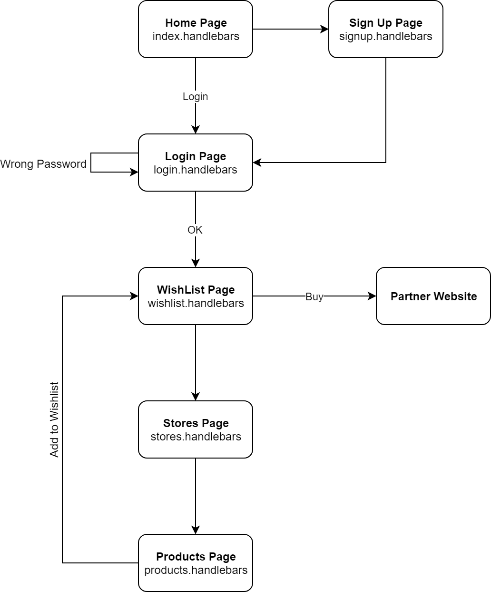

# Wishlist!
## https://project2-wishlist.herokuapp.com/login view app on live 

## About
"Wishlist" is an online application that allows user to select and bookmark items of clothing from a curated selection of online retailers. It’s easy! Create a sign-up name, login, and select an item from one of our partners to add to your Wishlist. 

Below you will find an image of how our application design functions:

 

##  Technologies Used

## Front End: 
**HTML, CSS, javaScript, jQuery, Handlebars**

### Back End: 
**Node Express**

### Database: 
**MySql, Sequelize** 

### Testing: 
**Mocha Chai**

### Deployment: 
**Heroku**

### Other: 
**Bcrypt**

## Additional information

We utilized HTML, CSS, javascript, and jQuery in making this application. We also used Node, Express, MySql, and Sequelize. This application was created utilizing handlebars for server side templating. We incorporated authentication (json web tokens, sessions, etc.). We utilized a migration strategy for sharing data utilizing a seed/schema.sql file. We utilized catch and error handling via Mocha Chai. We utilized Bcrypt for password protection. We deployed this application using Heroku. 

# Sources

This project may have code from class activities, office hours notes, or from seeking help from TAs and teachers.
